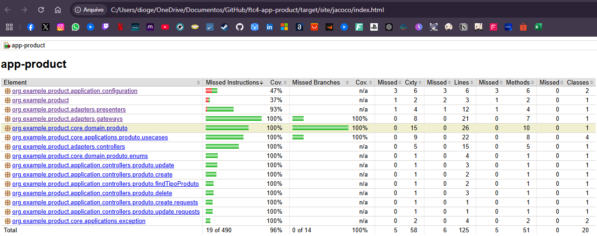
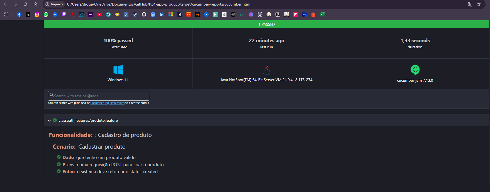

## Serviço de produto

Service que gerencia produtos em uma plataforma de e-commerce. Ele oferece funcionalidades para criar, atualizar, excluir e listar produtos.

# Testes
* Para rodar os testes, execute o comando `mvn test` na raiz do projeto.

Cobertura de testes:

# BDD
* Para rodar os testes de BDD, execute o comando `mvn test -P system-test` na raiz do projeto:

